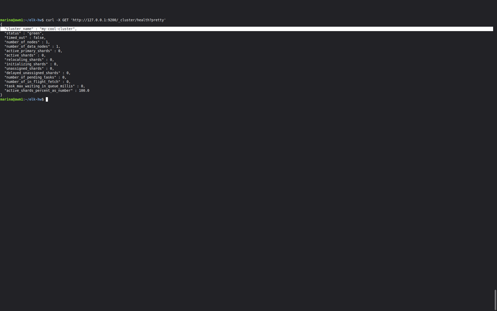
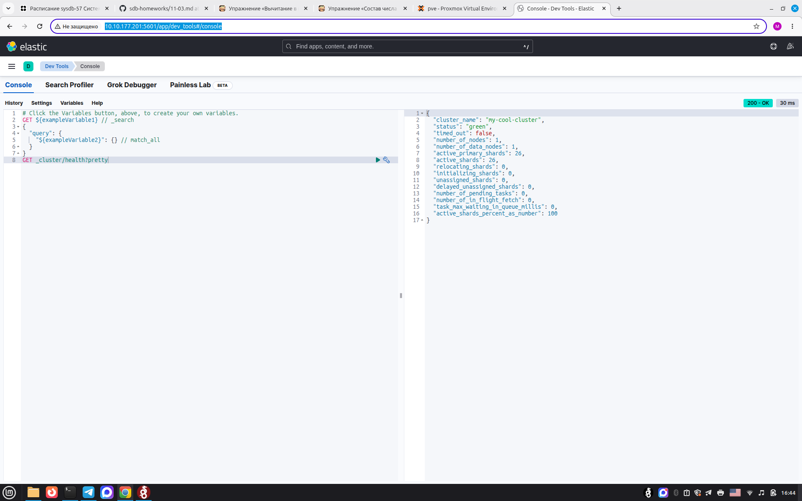
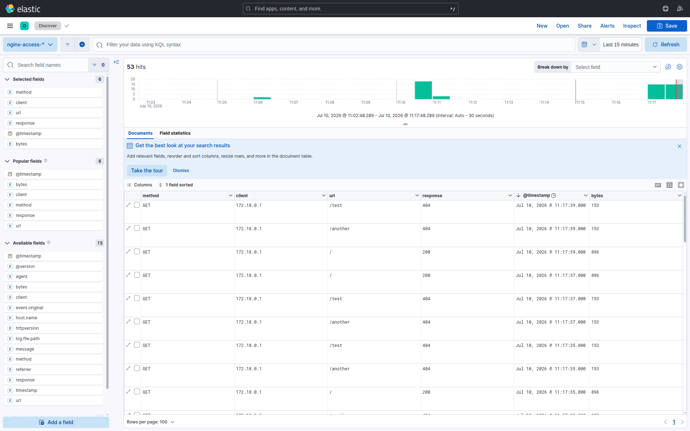
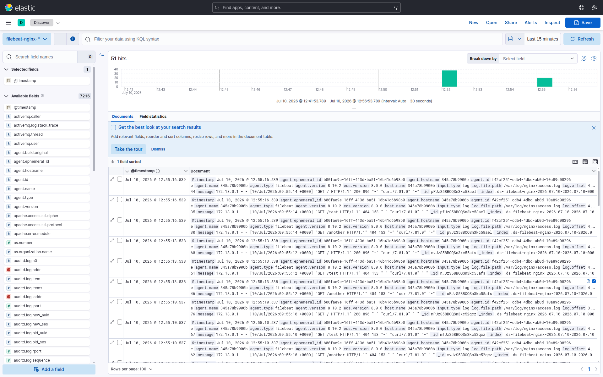
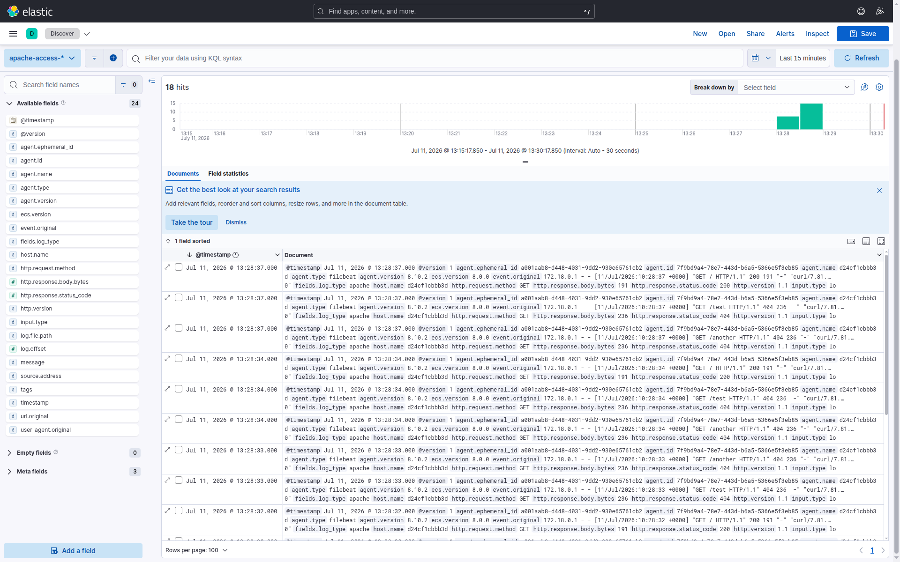

# ELK
## Домашнее задание к занятию «ELK»

## Задание 1. Elasticsearch
Установила и запустила Elasticsearch, изменила `cluster_name` на `my-cool-cluster`.  
Выполнила запрос `curl -X GET 'localhost:9200/_cluster/health?pretty'` и получила ответ:

## Задание 2. Kibana
Установила и запустила Kibana. В интерфейсе Dev Tools выполнила запрос `GET /_cluster/health?pretty`:

## Задание 3. Logstash

Настроила Logstash для сбора access-логов Nginx и отправки в Elasticsearch.  
Логи Nginx отображаются в Kibana (индекс `nginx-access-*`):

## Задание 4.  Filebeat
Переключила сбор логов Nginx на Filebeat (минуя Logstash).  
Логи Nginx отправлены через Filebeat и видны в Kibana (индекс `filebeat-nginx-*`):

## Задание 5*. Доставка данных
Настроила сбор логов **Apache HTTP Server**  через связку **Filebeat → Logstash → Elasticsearch**.  
Лог-файл Apache парсится Logstash с помощью `grok` и раскладывается на поля (`http.request.method`, `http.response.status_code`, `url.original` и др.).  
Логи Apache отображаются в Kibana (индекс `apache-access-*`):

**Какой сервис:** Apache HTTP Server.  
